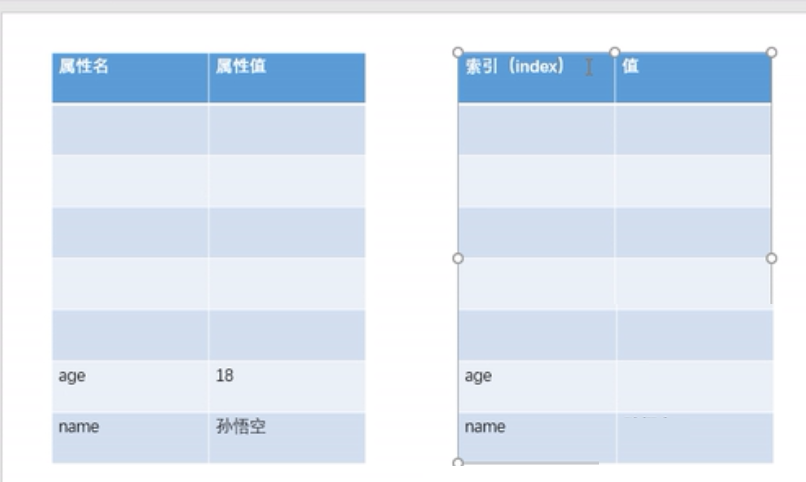

# 数组（Array）
 - 数组也是对象，和普通对象一样，存储值，不同的是用数字作为索引（index 从0开始的整数）

  
**创建数组**

```js
//1、使用构造方法创建数组对象
var arr = new Array();
//创建数组对象时赋值
var arr3 = new Array(1,2,3,4);
//2、使用字面量创建数组
var arr1 = [];
//使用字面量创建数组，同时赋值
var arr2 = [1,2,3,4];
//区别：
var arr4 = [10];//仅一个元素10
var arr5 = new Array(10);//长度为10
```

**添加元素**
- 向数组添加元素，可以为任意类型，也可为对象或函数或数组
```js
arr[0] = 10;
arr[1] = 20;
arr[2] = 30;
arr1 = ["hello",1,null];
arr1 = [{name:"小红"},{name:"小米"}];
//向数组添加对象
var obj = {name:"小明"};
arr1[arr2.length] = obj;
//向数组添加函数
arr1 = [function () {alert(1)},function () {alert(1)}];
//向数组添加数组
arr1 = [[1,2,4],[3,5,7]];//二维数组

//push向数组末尾添加元素，返回新长度
var result = arr1.push("糖糖");
//pop删除数组最后一个元素,返回删除元素
var result1 = arr1.pop();
//unshift向数组开头添加元素，返回新长度
arr1.unshift("明明");
//shift删除并返回数组第一个元素
var result2 = arr1.shift();
```
**读取元素**

```js
//读取数组元素
console.log(arr[0]);
console.log(arr[3]);//数组中不存在的索引为undefined

//遍历数组，就是将数组的元素取出来
for (var i=0; i<arr1.length;i++){
    console.log(arr1[i]);
}
//forEach(),只支持IE8浏览器以上。
// 由我们创建，不由我们调用的函数称为回调函数,有几个元素调用几次
//第一个参数正在遍历的元素
//第二个参数正在遍历元素的索引
//第三个参数正在遍历的对象
arr1.forEach(function(value,index,obj){
    console.log("value = "+value );
    console.log("index = "+index );
    console.log("obj = "+obj);
});
```
**提取元素**
- `slice（）`从数组中提取指定元素。
- 第一个参数：截取开始的位置索引，第二个参数：截取结束位置的索引,不包括结束位置
- `splice()`删除数组中指定元素，返回被删除元素，并添加新值。第一个参数：开始删除的位置索引
- 第二个参数：删除的个数，第三个参数：新添加的元素,自动插入开始索引前边
```js
result3 = arr1.slice(1,2);
arr1.slice(1);//可省略第二个，截取从开始以后的位置
arr1.slice(1,-2); //索引可以为负值，表示从最后开始数
console.log(result3);

var result4 = arr1.splice(0,2,"康康");
```
**其他操作**

```js
//concat连接两个数组
arr1.concat(arr2);
arr1.concat(arr2,arr3,"连接");

//join将数组转换为字符串
result = arr.join("_");//参数为连接符号，默认为，

//reverse反转数组
arr.reverse();

//sort排序,默认按Unicode编码排序
//返回>0的值，元素交换位置，<=0不变
arr.sort();
arr.sort(function (a,b) {
    return a-b;//升序
    // return b-a;//降序
});

//获取数组长度,
//连续数组，长度为数组长度（元素个数）；不连续，数组的最大索引+1
console.log(arr.length);

//修改length
arr.length = 4;
//向数组最后一个位置添加元素
arr[arr.length] = 40;
  ```

**遍历数组的练习**
```js
function Person(name, age) {
    this.name = name;
    this.age = age;
}
Person.prototype.toString = function () {
    return "Person[name=" +this.name+" age="+this.age+"]";
};

var person1 = new Person("Alice",24);
var person2 = new Person("Tom",21);
var person3 = new Person("Never",6);

var personArr = [person1,person2,person3];

function getAdult(arr){
    //创建新数组
    var newArr = [];
    //遍历personArr，获取arr中的Person对象
    for(var i=0; i< personArr.length;i++){
        var obj = personArr[i];
        //判断Person对象的age是否大于18,将对象放入新的数组中
        if (obj.age >= 18){
            newArr.push(obj);
        }
    }
    return newArr;
}
var result = getAdult();

console.log( "原数组 "+personArr);
console.log( "新数组 "+result);
```

**数组去重**

```js
var arr = [1,2,5,2,7,7,89,23];
for (var i=0;i<arr.length;i++){
    for (var j=i+1 ;j<arr.length;j++){
        if (arr[i] === arr[j]){
            //如果相等则证明出现相等元素，删除j对应的元素
            arr.splice(j,1);
            //当删除了j位置后，后边元素自动补位，即练习相等的值未比较
            j--;//关解语句
        }
    }
    // console.log(arr);
}
console.log(arr);
```