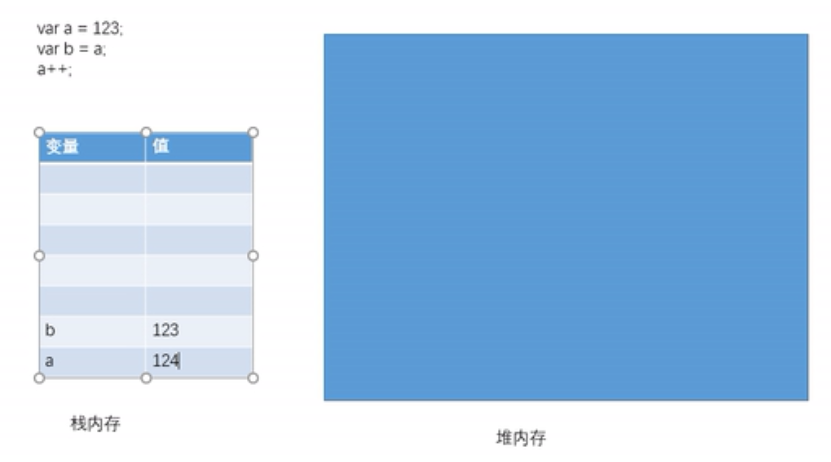
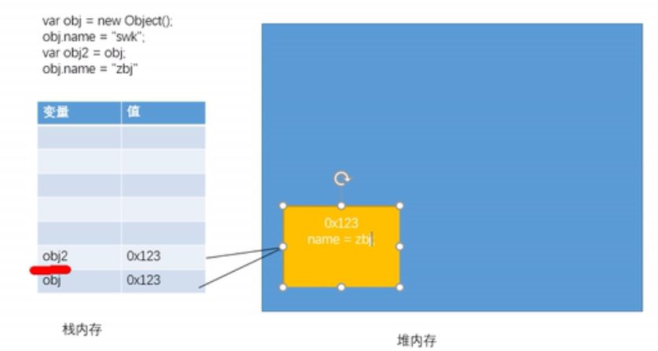
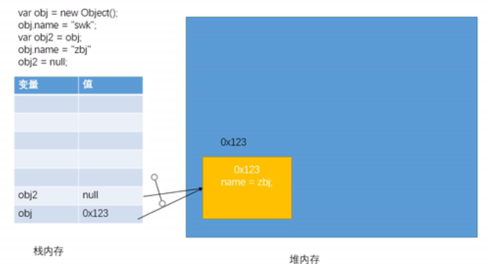
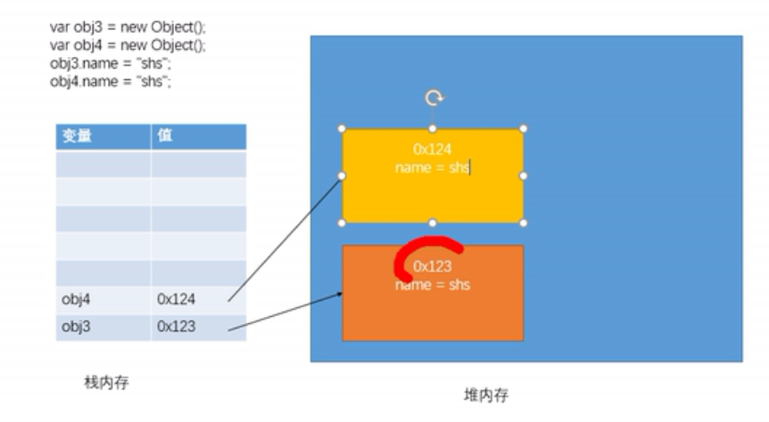

# 数据类型（字面量）
- **基本数据类型**：String字符串、Number数值、Boolean布尔值、Null空值、Undefined未定义
- 保存位置:

- **引用数据类型**：Object对象
- 保存位置：
  - 两个对象指向同一个地址，修改其中一个对象属性，则另一个也修改

  - 两个对象指向同一个地址，修改其中一个对象为null。另一个不变，修改的是链接.

  - 两个对象相同属性 


## 基本数据类型：
**1、String**
" hello" 或'hello'引起来，单引号可嵌套双引号，其他不行eg：'小明说："今天天气真好"'，可使用\进行作为转义字符。
```JS
alert("str")//输出字符串str
alert(str)//输出变量str值
```
**2、Number**
JS中的数值都是Number类型，包括整数和浮点数（小数）
```html
<script>
        var a = 123;
        var b = "123";

        console.log(a);
        console.log(typeof a);//检查变量a的类型
        console.log(b);
        console.log(typeof b);//检查变量b的类型

        console.log(Number.MAX_VALUE);//JS表示的最大值，超过141.7976931348623157e+308，返回Infinity表示正无穷，-Infinity表示负无穷。
        console.log(Number.MIN_VALUE);//表示0以上的最小值155e-324

        var c ="abc" * "bcd";
        console.log(c); //返回NaN，表示Not a Number

        // JS整数运算可以保证精确，浮点运算不一定。
        var d = 123 + 4564;
        console.log(d);
        var f = 0.1 + 0.2;
        console.log(f);
</script>
```
**3、Boolean类型**
true或false
 ```html
 <script>
        var bool = false;
        console.log(bool);
        console.log(typeof bool);
</script>
 ```

**4、Null类型**
空值，返回object类型，表示为空的对象。 

```JS
    var g = null;
    console.log(g);
    console.log(typeof g);a
```
**5、Undefined类型**
未定义，声明变量不赋值时。

```JS
    var h;
    console.log(h);
```
# 类型转换
主要是指：将其他类型转换为String、Number、Boolean
**1、强制类型转换为字符**
- 方法一：调用被转换类型的toString（）方法
- 不会影响原变量，会返回转换的结果，null、Undefined没有toString方法。
```JS
var a = 123;
a = a.toString();
// var c = null;
// c = c.toString();报错
console.log(typeof a);
console.log(a);
```
- 方法二:调用String（）函数
- 对于Number、Boolean实际上就是调用toString（）方法,对于null直接将null转换为"null"，Undefined同理。
```JS
var a = 123;
var d = String(a);
console.log(typeof d);
console.log(d);
```
**2、强制类型转换为数值**
- 方法一：调用Number（）函数
- 字符串---->数字：1、纯数字字符串，直接转为数字；2、有非数字内容，转换为NaN；3、空串或者全是空格，转换为0。
- 布尔------>数字：true 转为1，false 转为0
- Null------>数字：0
- Undefined->数字：NaN
```JS
var e = "123";
e = Number(e);
console.log(typeof e);
console.log(e);
```
- 方法二：专门用于字符串
- parseInt()把字符串转换为整数,将字符串中的有效整数取出，转换为Number
- parseFloat（）同，取得是浮点数（有效小数）
```JS
var f = "123px";
f = parseInt( f);
a = parseInt(f,10);//第二个数字表示数字为十进制
console.log(typeof f);
console.log(f);


var g = "123.456";
g = parseFloat(g);
console.log(typeof g);
console.log(g);
```
**3、强制类型转换为布尔**
- 调用Boolean（）函数
- 数字----->布尔：除0和NaN，都是true
- 字符串--->布尔：除空串，都是true
- null、Undefined--->布尔：false
```JS
var a = 123;
a = Boolean(a);
console.log(typeof a);
console.log(a);
```
# 包装类
- JS中提供三种包装类，可以将基本数据类型的数据转换为对象
- String（）
- Number（）
- Boolean（）
- 方法和属性只能添加给对象，不能添加给基本数据类型.
- 当我们对一些基本数据类型的值去调用属性和方法时，浏览器会临时使用包装类将其转换为对象，然后再调用对象的属性和方法，调用完以后，在将其转换为基本数据类型
```js
//在开发中不用
var num = new Number(3);
var str = new String("hello");
var bool = new Boolean(true);
num.hello = "abs";
var s = 123;
s = s.toString();
s.hello = "你好";

console.log(s.hello);
console.log(typeof bool);
```