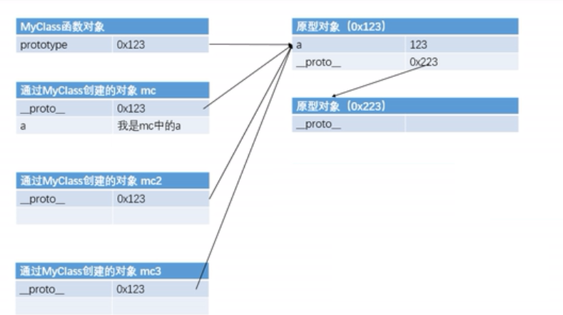

# 原型对象
- 我们所创建的每一个函数，解析器都会向函数中添加一个prototype属性，这个属性对应的对象，叫做**原型对象**

- 当函数作为普通对象调用时，没有作用
- 当函数以构造函数调用时，他所创建的对象中有一个隐含的属性，指向该**构造函数的原型对象**
- 原型对象相当于一个公共的区域，所有同一类的实例都可以访问到这个原型对象,通过`__proto__`访问
- **查找时**：访问对象的属性或者方法时，先在对象自身寻找，若有直接使用，若没有则会在原型对象中寻找。原型对象也是对象，也有原型。使用对象或方法时，会在自身中寻找，若没有则去原型对象中寻找，也没有，去原型的原型中找,直到找到Object的原型。
```js
function Person() {

}
//向Person原型对象中添加属性
Person.prototype.name = "原型对象名字为：小明";
//向Person原型对象中添加方法
Person.prototype.sayHello = function(){
    console.log("Hello");
};
//向Person原型对象中添加方法
Person.prototype.sayName = function () {
    console.log("我是" + this.name);
};

function Dog(){

}
var person1 = new Person();
var person2 = new Person();
//向person1中添加属性
person1.name = "person1的姓名为：小米";
//检测原型变量中是否有添加进去此属性，in检查时对象中无，原型中有也为true
console.log("name" in person1);//true
//hasOwnProperty检查自身中是否存在，对象自身中存在时才会为true
console.log(person1.hasOwnProperty("name"));//true
console.log(person1.__proto__.hasOwnProperty("hasOwnProperty"));//false
console.log(person1.__proto__.__proto__.hasOwnProperty("hasOwnProperty"));//true


console.log(Person.prototype);
console.log(Dog.prototype);
console.log(Person.prototype === Dog.prototype);//false

console.log(person1.__proto__);
console.log(Person.prototype === person1.__proto__);//true
console.log(Person.prototype === person2.__proto__);//true

console.log(person1.name);
console.log(person2.name);
person1.sayHello();
person2.sayName();
```
# toString
- 在页面中打印对象时，实际上输出对象的toString（）方法的返回值
- 可以为对象添加同String方法
- 不添加toString方法 调用person1.toString()，输出[object Object]
- 添加后输出toString方法的结果：Person[name=Alice age=24 gender=女]
```js
function Person(name, age ,gender) {
    this.name = name;
    this.age = age;
    this.gender = gender;
}
//为原型添加toString方法
Person.prototype.toString = function () {
    return "Person[name=" +this.name+" age="+this.age+" gender="+ this.gender+"]"
};
var person1 = new Person("Alice",24,"女");
console.log(person1);
console.log(person1.toString());
```