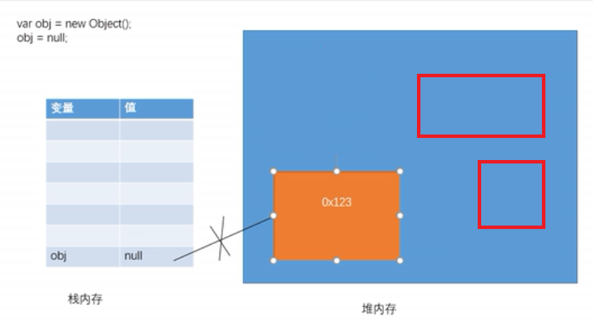
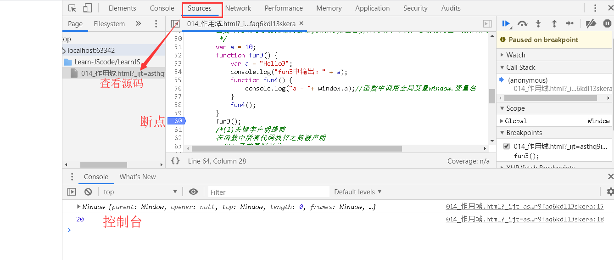

- 此文档为学习并整理的JavaScript笔记，仅用于自行学习使用
- 打开控制台：`F12/ctrl+shift+i/更多工具->开发者工具`

[veiw nodes](https://gaoyubest.github.io/GyHelloJavaScripyt)

## 目录

*   [1.、数据类型&类型转换&包装类](01_数据类型_类型转换_包装类.md)
*   [2、运算符](02_运算符.md)
*   [3、流程控制语句](03_流程控制语句.md)
*   [4、对象](04_对象.md)
*   [5、函数_方法_arguments](05_函数_方法_arguments.md)
*   [6、闭包](06_闭包.md)
*   [7、作用域](07_作用域md)
*   [8、this](08_this.md)
*   [9、原型对象_toString](09_原型对象_toString.md)
*   [10、数组](010_数组.md)
*   [11、Date](011_Date.md)
*   [12、Math](012_Math.md)
*   [13、字符串方法](013_字符串方法.md)


# Javascript介绍：
**JavaScript** ，主要用于处理网页中的前端验证（检查用户输入的内容是否符合一定的规则，比如：用户名的长度，密码长度，邮箱格式等）。
**JavaScript包含三部分**：ECMAScript标准、DOM（文档对象模型）、BOM（浏览器对象模型）
**语法划分**：ECMAScript5、ECMAScript6、TypeScript
**运行环境**：WebJS、NodeJS
**ECMAScript标准**：
|浏览器|JavaScript实现方式|
|-----|-----|
|FireFox|SpiderMonkey|
|Internet Explorer|JScript/Chakra|
|Safari|JavaScriptCore|
|Chrome|v8|
|Carakan|Carakan|
# JavaScript语法基础
**JS代码位置(4)**：
- button onlink属性中
- a标签href中
- `<script>`标签中
- 引用外部JS文件
```JavaScript
<body>
    <button onclick="alert('单击按钮时执行代码')"> 按钮1</button>
    <a href="javascript:alert('点我时执行代码')">按钮2</a>
</body>
<head>
    <meta charset="UTF-8">
    <title></title>
    <script src="01JS.js"></script>
    <!--引入外部JS文件不能在编写内部要求，可再建立script标签 -->
    <script>
        alert("我是内部JS代码")
    </script>
</head>
```
**代码块：**
- {}只起分组作用

**注释(2)**：
```js
/*
多行注释
*/

//单行注释
```

**语法规则**：
- 语句以分号结尾
- 严格区分大小写
- JS自动忽略多个空格和换行

**赋值(2)**：
```html
<script>
var a; //声明变量
a=123;//赋值变量
concole.log(a);

var age = 80;//同时声明赋值
console.log(age)
</script>
```
**输出(3)**：
```html
<script>
alert("这是我的第一行JS代码");//控制浏览器弹出一个警告（BOM）
document.write("Hello!");//document.write向body中输出一个内容（DOM）
console.log("Who are you ?");//向控制台输出内容（ECMAScript）
</script>
```
**标识符**：所有自主命名的都为标识符，eg：变量名、函数名、属性名

**命名规则**：
- 1、可包含：`字母、数学、_、& `
- 2、不能以数字开头
- 3、不能是ES中的关键字及保留字
- 4、`驼峰命名法`，首字母小写，每个单词开头字母大写，其余字母小写。eg：**helloWorld**
- JS底层中保存标识符时实际上是采用Unicode编码，理论上所有的utf-8中含有的内容都可以作为标识符。eg:var 小白=90

**概念**：
- 字面量：不可改变的值，eg：1、2、3、4等可以直接使用。
- 变量：变量可以直接保存字面量，变量的值可以任意改变
  
**进制问题**
- 16进制的数用0x开头
- 8进制数字用0开头
- 2进制数字用0b开头，不是所有浏览器都支持
```JS
a = 0x10;
a = 070
```
**Unicode编码（2）**
- 第一种：控制台，\u四位编码
- 第二种，在网页中，&#十进制编码
```JS
第一种：
<script>
    console.log("\u2620");
</script>

<body>
        <h1 style="font-size: 200px;"> &#9760;</h1>
</body>
```
**计时器**
```js
console.time("test");
console.timeEnd("test");
```
**prompt（）**
- 可以弹出一个自带文本框的提示框
- 判断成绩，输入错误数字可再次输入
```js
while (true){
    var score = prompt("输入成绩(0-100)："); 
    if (score >= 0 && score <= 100){
        break;
    }
    alert("请输入有效的分数！")
}

//判断成绩是否是数字
if (score >100 || score<0 || isNaN(score)) {

}
<!--单击按钮没有任何跳转-->
 <a href="javascript:;)">按钮3</a>
```
**垃圾回收（GC）**
- 当对象没有任何变量或属性进行引用时，无法进行操作该对象，此对象为垃圾。
```js
var obj = new Object();
obj = null;//此时JS会自动回收
```


Google控制台查看运行结果：
